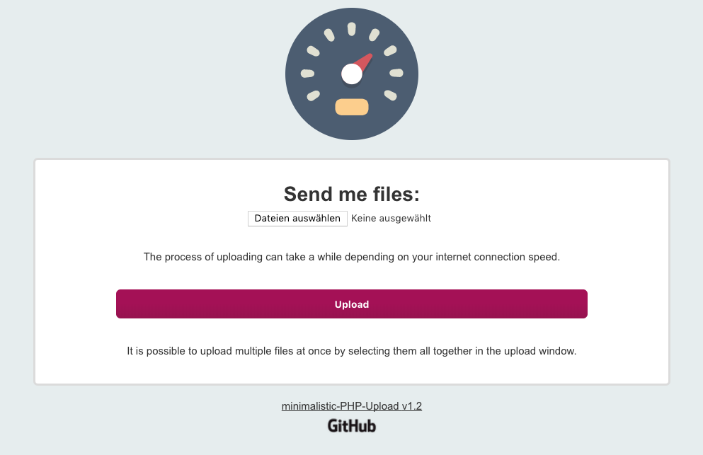

# minimalistic PHP Upload

Need a minimalistic upload script for sharing files? Use this! 

* **simple installation**
* **File Upload to server directory**
* **eMail notification**

Installation
------------
* Open index.php with your favorite editor and **change the SETTINGS block** to your Domain @ Mail-Address

* **Copy all the files** and folders to you websever (e.g. to ./upload/*) - double check that you've copied the .htaccess file too.

* Open https://yourdomain.com/upload and try your **new minimalistic upload script for sharing files** - you should recieve an email with further information directly after someone uploaded a file.

Project details
-------------
Author: Tim Lüdtke (https://timluedtke.de)

**Version 1.3 (Feb 2023)**

Licencend Images
----
All graphics used in this project are licensed under the GPL license:
* [Circle-icons-speedometer.svg](https://commons.wikimedia.org/wiki/File:Circle-icons-speedometer.svg)
* [GitHub_Logo.png](https://github.com/logos) 

The project itself is although licenced under GPL: see here for [license details](LICENSE)

Changelog
-----------
### Version 1.3
* Support for php 8.x added
* sending email prevented if zero files have been uploaded

### Version 1.2.1
* Swapped the text in the bottom and the sublines to ensure the user reads the helping hints in the correct order

### Version 1.2
* language support added (de/eng) 
* SEO noindex added 
* cleaned up filestructure

### Version 1.1
* styling fixes and text changes